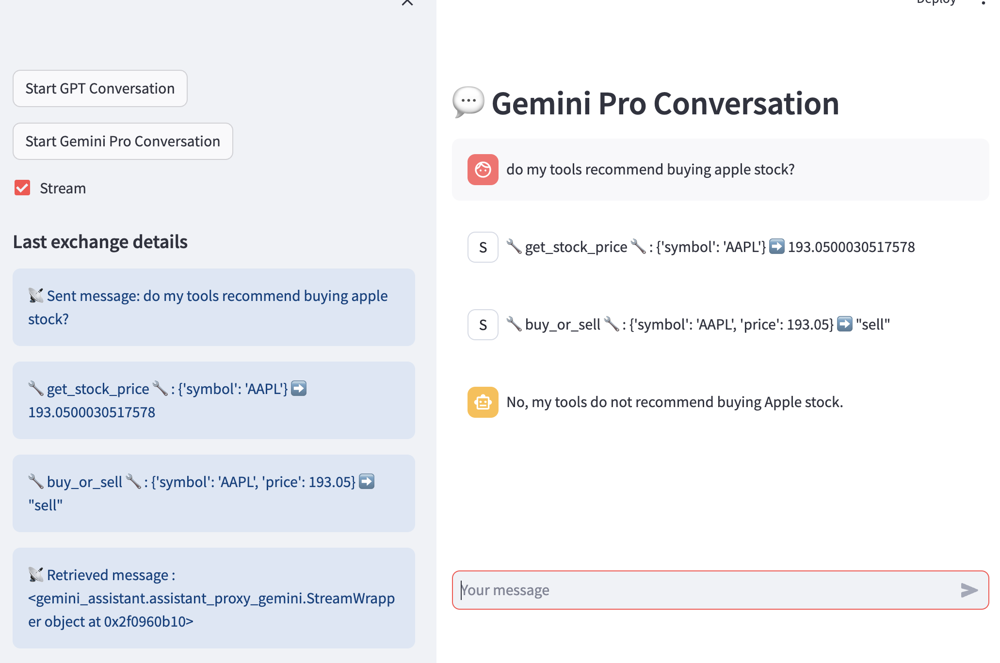

# Framework for building GPT and Gemini Pro integrations through a unified design

This is a pilot toolkit for building well-designed, resilient Python-based integrations with both OpenAI's Assistants APIand Google Gemini Pro Vertex AI API, through a unified design.

The deisgn decouples the internal and external functionality related to the integrations, using a Mediator (based on a state-machine) in the middle to orchestrate a "scripted interaction" at the boundary of the system. This design allows the system to stay flexible and evolve with ease, accomodating future external and internal changes. It can also be used for other similar API integrations.

## Approach

Here are the main ideas behind the design of this toolkit:

1. Maintain an **end-to-end perspective** of the flows that have assistants as particpants; the integration with the external API is just one piece of the puzzle. One needs full visibility into the end-to-end execution of the AI-powered workflows.


2. The conversation between the client system and the Assistants follows a **pre-defined interaction script**, modeled as a **state machine**. The main actors are a **User Proxy** and an **Assistant Proxy**, interacting indirectly under the supervision of a **Mediator** who owns the interaction script.


3. The **Assistant Proxy** acts on behalf of the Assistant, managing the calls to the external API (and having exclusivity in doing so), and interacting indirectly with the User Proxy via the Mediator. It becomes an **active player** in the client ecosystem, proxy-ing the passive remote Assistant.


4. **The User Proxy** acts on behalf of the user and other internal systems that require external API integration, interacting indirectly with the Assistant Proxy via the Mediator and making supporting internal calls as needed (such as executing function tools registered with the assistant when instructed so by the Assistant, via the Mediator).

## Design

The diagram below shows how the User Proxy, Assistant Proxy and Mediator work together within the distributed overall ecosystem to implement a clean integration with the Assistants API:


The User Proxy initiates a conversation exchange through a prompt, and assists with function call execution as needed.

Once the conversation exchange is started, the Assistant Proxy makes regular calls to the Assistants API to check on the Run status (polling), and processes the return status accordingly, with the help of the Mediator. 

As mentioned earlier, the Mediator is implemented (formally or informally) as a state machine, with transitions as shown below:


The states are based on:

1. the external Assistant's Run status
2. the status of supporting internal calls, related to executing required actions

and provide an aggregate reflection of the overall execution rather than just the Assistant's progress.

The dotted-line transitions are allowed in case the "running" state is missed when polling the Assisstans API (which can happen when processing is faster than the polling interval, or when polling is delayed, like it may happen when the app is running in debug mode with break points).

The Mediator also publishes events related to the progress of the interaction, so that interested systems can subscribe and stay updated.

The sequence diagram below shows the  "interaction contract" during a conversation exchange, orchestrated by the Mediator:


### Implementation details

The GPT Assistaant Proxy and Gemini Pro Assistant Proxy implement the internal contract above, and have specific behavior dictatated by the external contract to connect with the respective API.

The OpenAI GPT and Google Gemini client libraries have both similarities and differences in how they can be used:

- Gemini does not have an explicit concept of Assistants, like GPT does; therefore, with Gemini specific configuration is done at the conversation level
- GPT Thread and Gemini Chat are similar concepts in nature
- GPT requires API polling after requests are sent, while Gemini supports request/reply communication 
- Both GPT and Gemini have support for tools and function-calling, with OpenAPI-based declarations (and use similar terminology)
- Gemini does not have an explicit equivalent of GPT’s Run concept
- Gemini supports streaming, while GPT does not at the time of this writing

Here is the sequence diagram for the GPT Proxy:


and here is the one for the Gemini Pro Proxy:


There are two implementations for the Mediator:

- `MediatorBasic`, a plain Python implementation, that does not enforce pre-conditions for state transitions
- `MediatorStateMachine`, with all bells and whistle, using [transitions](https://github.com/pytransitions/transitions), an excellent state machine implementation in Python.

## User Interface

A streamlit-based Chat App allows users to carry conversations with both GPT and Gemini Pro assistants. A GPT test assistant configuration is also included, to be deployed and used in order to explore the available toolkit features. It is configured with 2 "toy" functions as tools. The same functions are used to configure the Gemini Pro chat. See screenhot below:



Please note how the function calls trigerred by the assistant via required actions are displayed as part of the conversation, with "System" as source. The execution steps are also shown when the exchange is completed, and one can show them real time as well if needed.

## Dependencies

Python 3.x (developed with 3.11)

streamlit~=1.29.0

streamlit-aggrid~=0.3.4

pydantic~=2.5.2

Pypubsub~=4.0.3

SQLAlchemy~=2.0.23

pandas~=2.1.4

openai~=1.3.8

yfinance~=0.2.33

transitions~=0.9.0

python-dotenv~=1.0.0

## Setup

### Code and dependencies

Clone this repository and use your favorite IDE to open it as a project:

```bash
git clone https://github.com/exponentis/gpt-gemini-proxy-unified-design.git
```

Create a virtual environment, activate it and install dependencies. Thiis is how it works if you use anaconda:

```bash
cd gpt-gemini-proxy-unified-design
conda create -n  asstapi python=3.11 anaconda
source activate asstapi 
pip install -r requirements.txt
```
Install Google Cloud SDK, create a project and authenticate:

```bash
curl https://sdk.cloud.google.com | bash 
gcloud auth application-default login   
```

### Configuration

Copy the contents of the file `.env_sample` to a new file named `.env` and update the variables

### GPT Assistant

Edit the script `assistant_setup.py` to make sure you are using the right model (some users may only have access to gpt-3.5) and run it from root folder:

```python
python -m setup.assistant_setup

```
Capture the assistant ID (either from your OpenAI gpt+ account, or from the terminal after running the above script) and 
update the `ASSISTANT_ID` variable in the `.env` file

## Using the toolkit

The code below is all it takes to start chatting from a terminal:

```python
import sys
import conversation
import asyncio
import traceback
import os

async def run():
    choice = input("\ngpt or gemini: ")
    if choice == 'gpt':
        asst_id = os.environ["ASSISTANT_ID"]
        user_proxy = conversation.start_conversation('gpt', assistant_id=asst_id)
    elif choice == 'gemini':
        user_proxy = conversation.start_conversation('gemini')
    else:
        raise ValueError(f"Invalid choice: {choice}")

    while (True):
        user_input = input("\nUser: ")
        if (user_input.lower() == "exit"):
            break
        user_proxy.send_user_message(user_input, use_streamming=True)

        response = await user_proxy.get_assistant_message()
        if isinstance(response, str):
            print("Assistant: ", end="")
            print(response)
        else:
            sys.stdout.write("Assistant: ")
            for msg in response:
                sys.stdout.write(msg)

if __name__ == '__main__':
    try:
        asyncio.run(run())
    except Exception as e:
        print(traceback.format_exc())
```

That's the contents of `terminal-chat.py`; run it as below:

```python
python terminal-chat.py
```

## Running the Streamlit Chat app

Open the chat page to start conversations with assistants by running:

```python
streamlit run streamlit-chat.py
```


